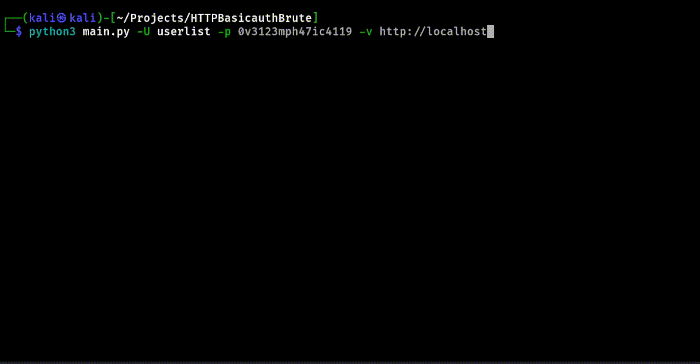

# Description
This script is suitable for brute force attacks on HTTP Basic Auth (for example .htaccess/tomcat basic auth, etc.). The script can work in password spraying mode (you can provide a list of users and one password). You can try passwords for a list of users or for one specific one.

## NOTE THAT A DICTIONARY BRUTE FORCE ATTACK IS BEING CONDUCTED (MEAN, YOU NEED TO PROVIDE A LIST, THE SCRIPT ITSELF DOES NOT GENERATE PASSWORDS)

# Usage

`-h - help menu`
`-v - verbose mode`
`-U - userlist`
`-P - passwordlist`
`-u - single user`
`-p - single password`

# Screens/GIFs

## Password spraying

## Dict. brute force

## Multiple

